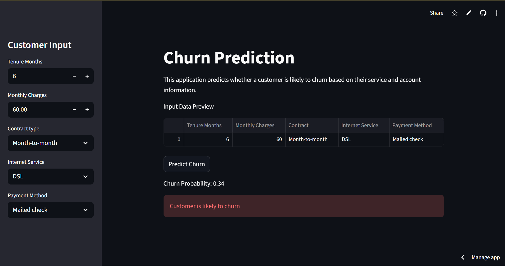
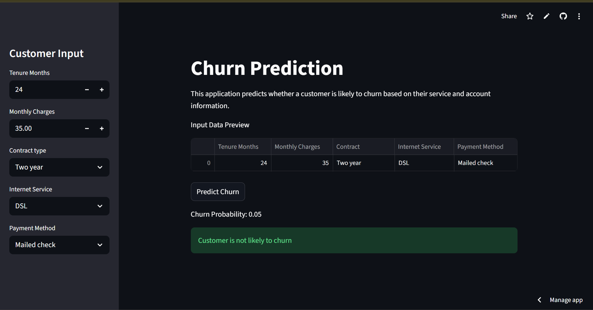

# 📊 Customer Churn Prediction

An end-to-end **Customer Churn Prediction** project using Machine Learning to identify customers likely to discontinue a service.  
The project includes **data analysis, feature engineering, model interpretation, and deployment** using **Streamlit**.

---

## 🚀 Live Demo

🔗 **Deployed Application:**  
👉 https://prince-customer-churn-prediction.streamlit.app/

---

## 🖼 Application Screenshots

### 🔹 Churn  Input


### 🔹 Not Churn Input


---

## 🧠 Problem Statement

Customer churn is a critical business problem that directly affects revenue and growth.  
The goal of this project is to:

> **Predict the probability of customer churn and convert it into a clear business decision.**

---

## 📦 Dataset Overview

- Telecom customer dataset  
- Combination of **numerical and categorical features**  
- Several features contain **meaningful missing values**  
- Binary target variable indicating churn  

---

## 🛠️ Approach & Methodology

### 1️⃣ Exploratory Data Analysis (EDA)
- Distribution analysis of numerical features  
- Churn vs feature relationships  
- Identification of missing value patterns  

### 2️⃣ Feature Engineering
- Median imputation for numerical features  
- Most-frequent imputation for categorical features  
- Explicit **missing indicators** for important numeric columns  
- One-hot encoding with safe handling of unseen categories  

### 3️⃣ Modeling
- Baseline **Logistic Regression**  
- Logistic Regression with **missing indicators**  
- Performance comparison using **ROC-AUC**  
- Removal of low-signal, high-missingness features  

### 4️⃣ Model Interpretation
- Coefficient analysis  
- Validation of the hypothesis:  
  **“Missingness itself is predictive of churn.”**  

### 5️⃣ Deployment
- End-to-end preprocessing and modeling pipeline saved using `joblib`  
- Interactive **Streamlit web application**  
- Real-time churn probability prediction  

---

## 📈 Model Performance

- **Evaluation Metric:** ROC-AUC  
- Logistic Regression with missing indicators significantly outperformed the baseline  
- Model learned interpretable and domain-consistent patterns  

---

## 🖥 Streamlit Application Features

- Sidebar-based customer input  
- Real-time churn probability prediction  
- Clear churn / no-churn decision  
- Robust handling of missing and unseen inputs  
- Schema-safe inference using the trained pipeline  

---

## 📁 Project Structure
```
customer-churn-prediction/
│
├── app.py # Streamlit application
├── churn_model.pkl # Trained ML pipeline
├── decision_threshold.pkl # Decision threshold
├── notebooks/
│ └── churn_analysis.ipynb # EDA & model training
├── screenshots/
│ ├── input.png
│ └── output.png
├── requirements.txt
└── README.md 
```
---

## ⚙️ How to Run Locally

```bash
pip install -r requirements.txt
streamlit run app.py
``` 
---

## 👤 Author

Prince Shah
Machine Learning Enthusiast
GitHub: https://github.com/Prince2409shah

---